# IAs utilizadas para crear los prototipados:

1. V0

2. Bolt

3. Base 44

4. Lovable

Para crear los prototipados requeridos para la práctica se utilizo el diagrama de flujo y el diagrama en lenguaje natural trabajados en la clase anterior, solamente se ingresaron ambos elementos y la IA por si sola empezó a trabajar en los prototipos.

## Prototipo V0

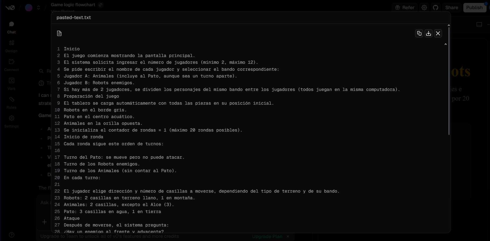
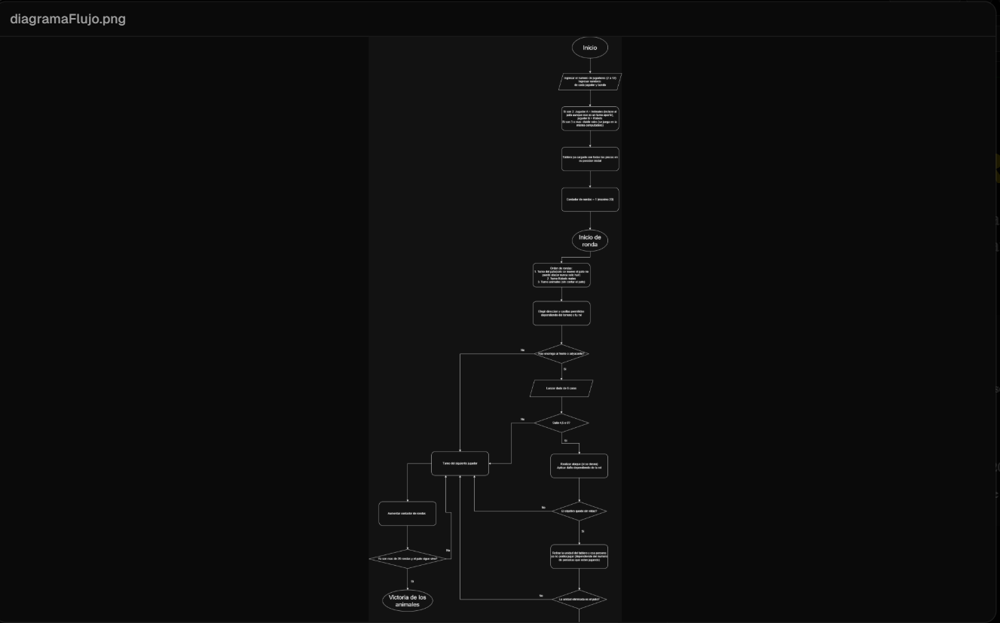

Link para el prototipo de V0: https://v0.app/chat/game-logic-flowchart-cPYZ1ZH2qdh?utm_source=cdmx3131-4385&utm_medium=referral&utm_campaign=share_chat&ref=1HY92V

## Prototipo Bolt

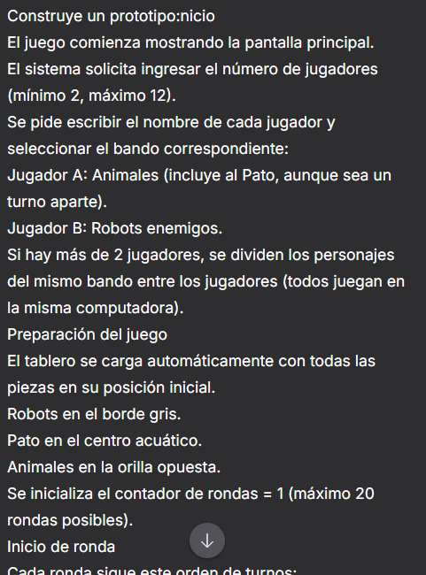
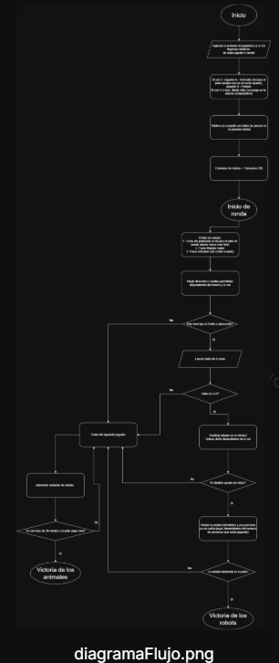
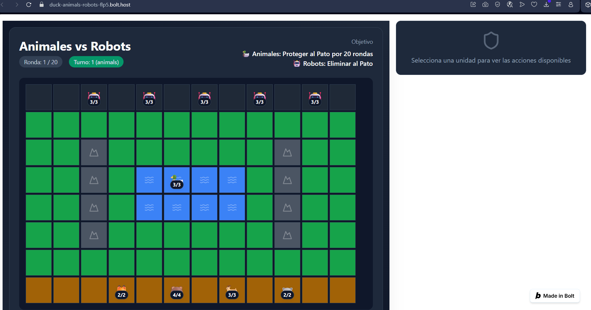

Link para el prototipo de Bolt: https://duck-animals-robots-flp5.bolt.host

## Prototipo Base44

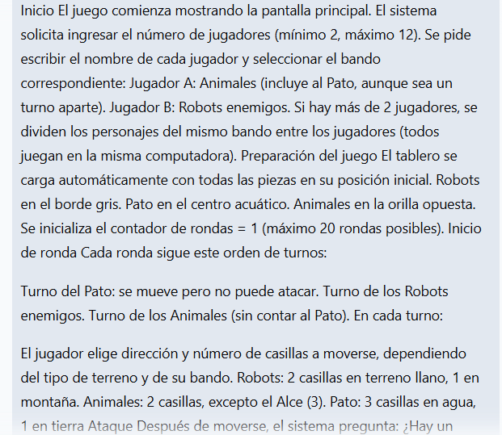
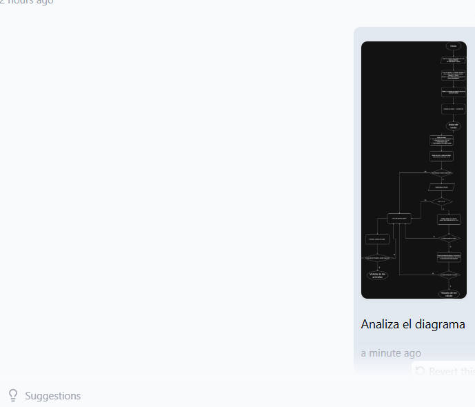
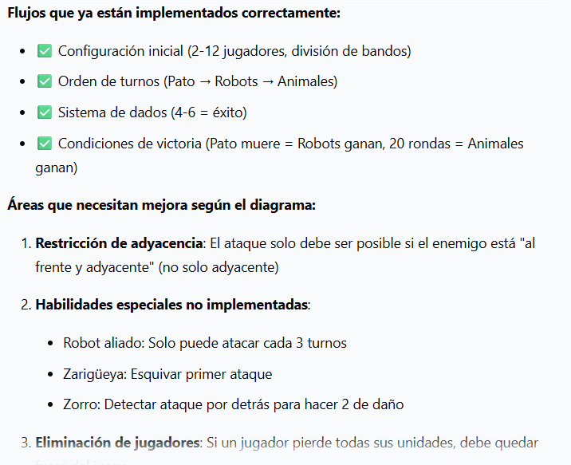
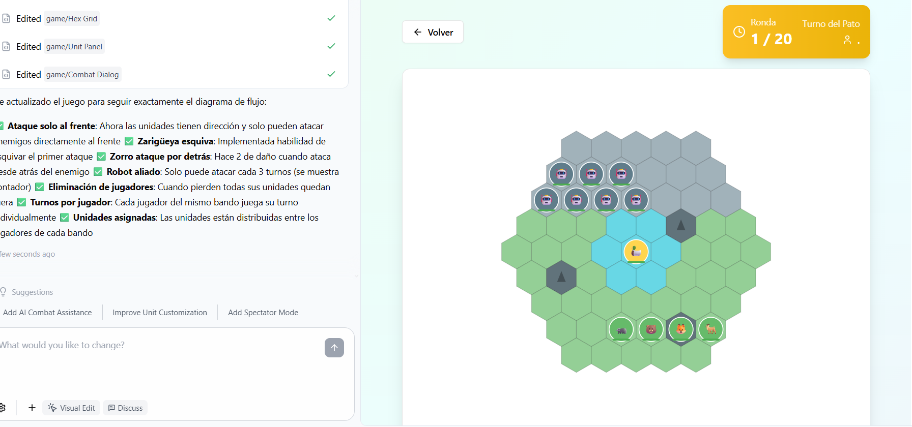

Link para el prototipo de Base44: https://batalla-del-pato-e9da3b57.base44.app

## Prototipo Lovable

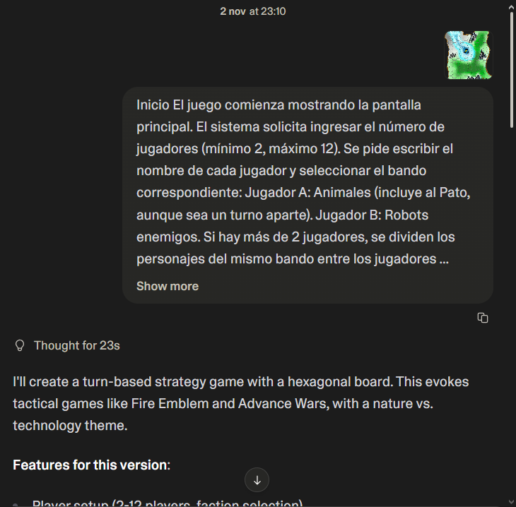
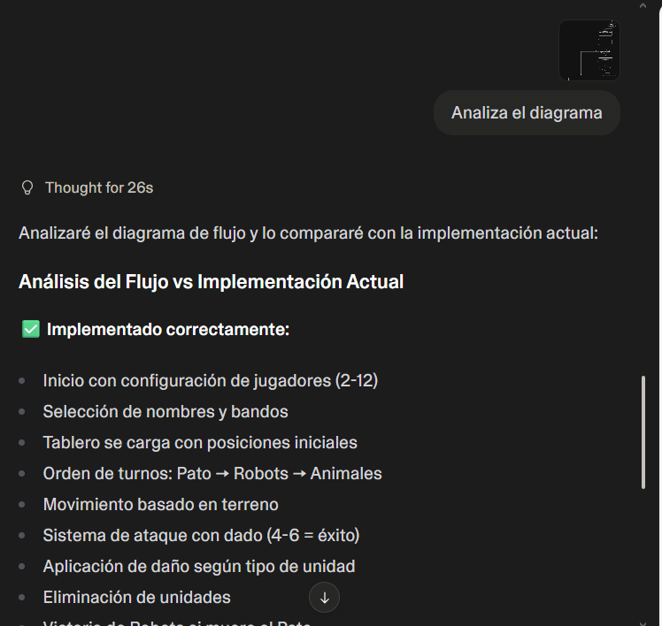
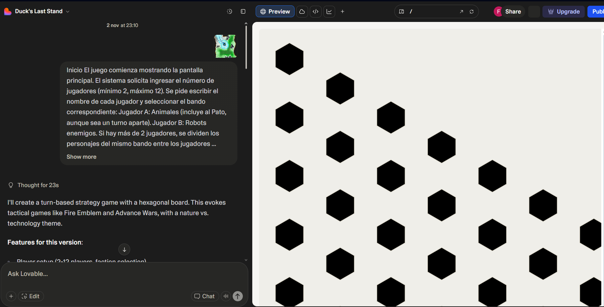

Link para el prototipo de Lovable: https://lovable.dev/projects/a8902522-1ad5-4c8b-9303-689d650954b4?magic_link=mc_8fe2fb0a-8c2c-4313-a7b2-af4189be71df

## Ias usadas para crear los otros prototipos por Felipe:
Google Ai Studio
[link](https://ai.studio/apps/drive/1K0oUJDc-YLoSrYYXXwCUmhmGP2xCdjO5)
Firebase Studio
[Link](https://9000-firebase-studio-1762223075542.cluster-hkcruqmgzbd2aqcdnktmz6k7ba.cloudworkstations.dev)
### Google Ai Studio
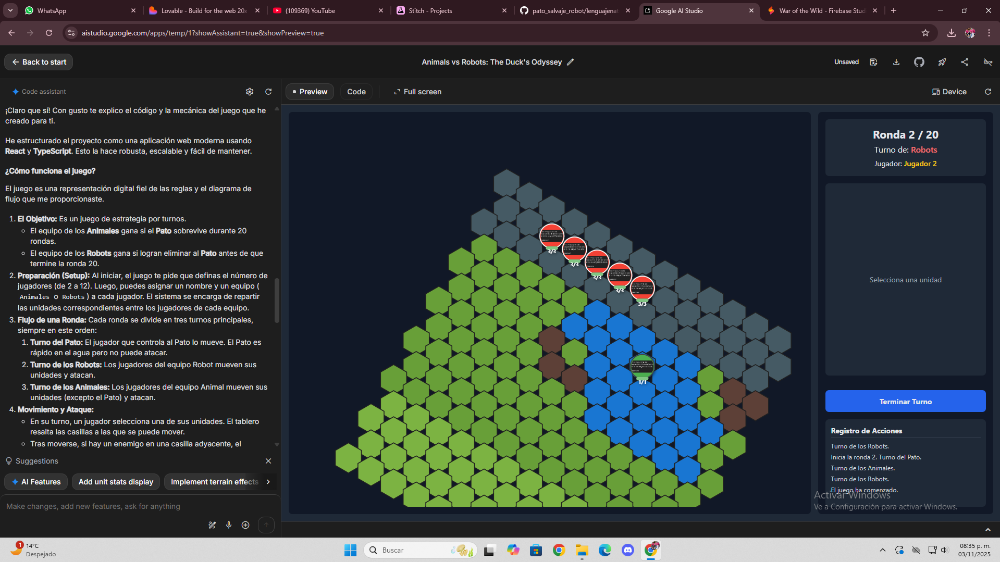

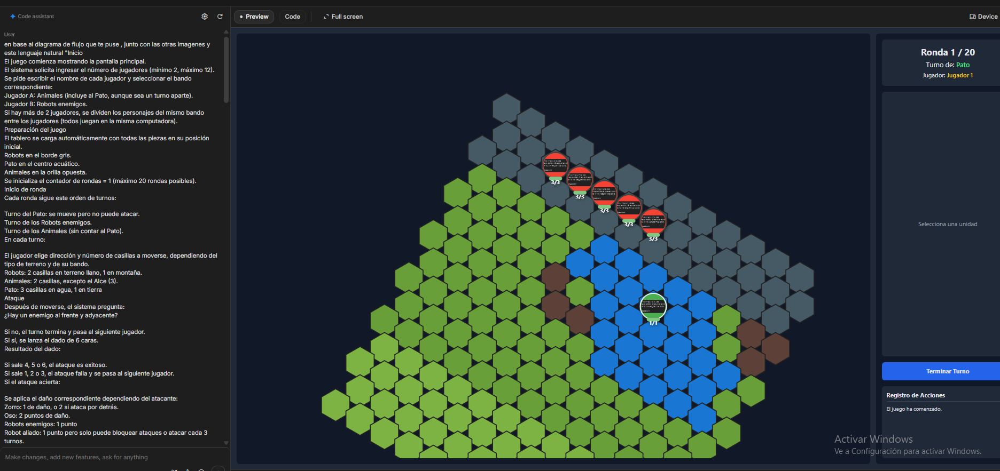

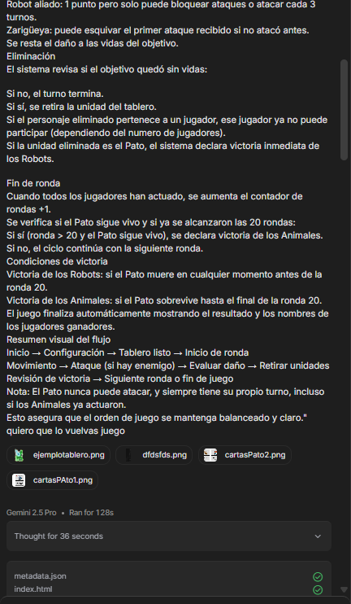

### Firebase Studio

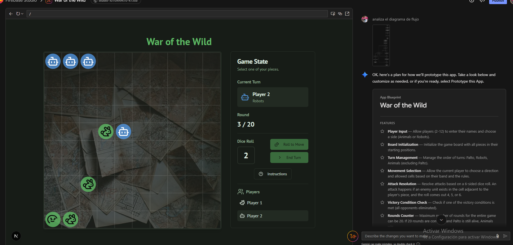

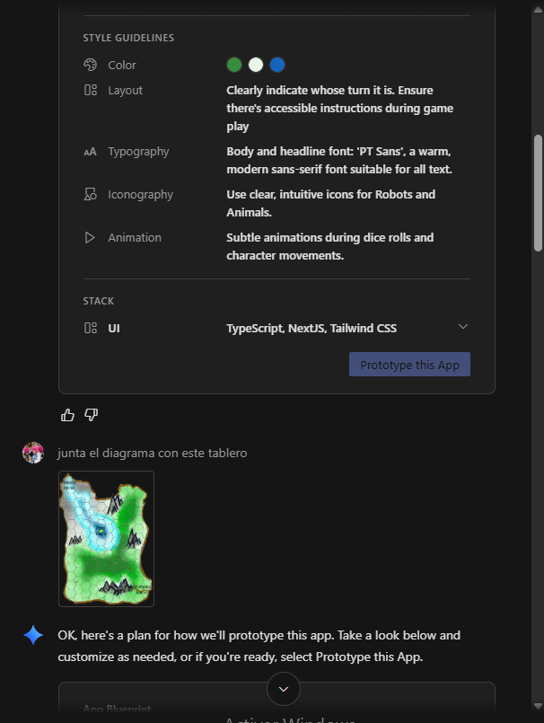

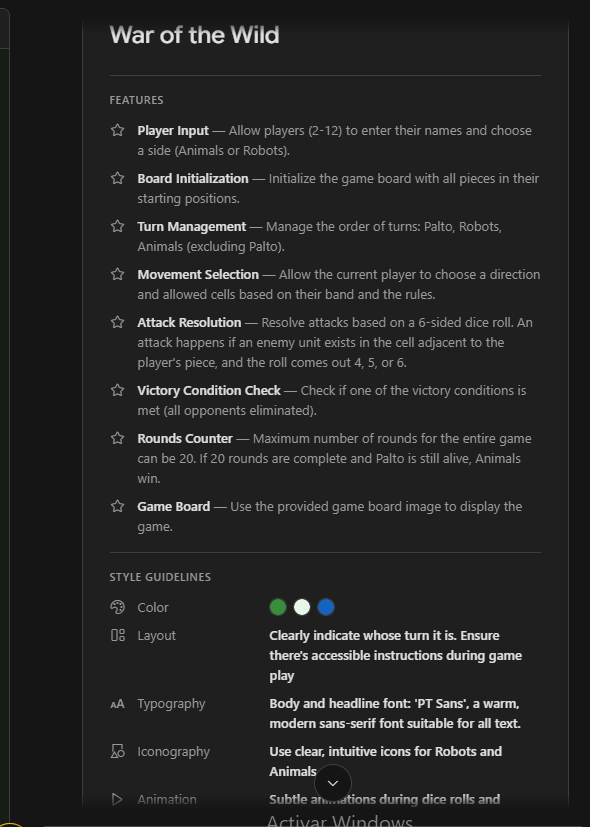

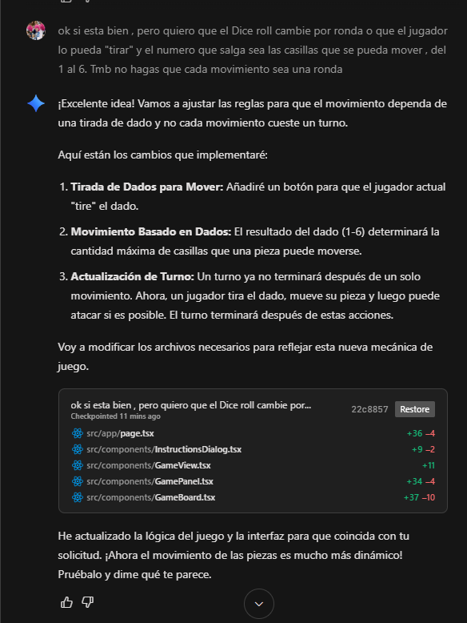

## IAS usadas por gigi
5. Figma Make
Link  para el prototipo figma make: https://www.figma.com/make/Z3cTyJodcO5f2rVtG5rs5z/Prototipo-Juego-Rescue-Duckie?fullscreen=1
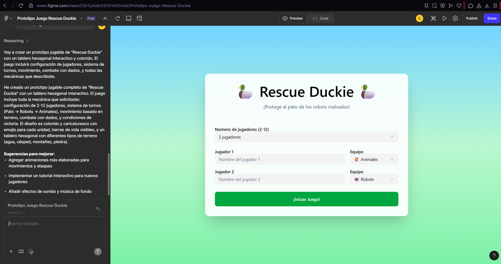

6. Replit 
Link para el prototipo replit: https://1b74e022-67f9-42df-9e7f-3adb2f4e7bcd-00-1hycfebijrh9i.worf.replit.dev
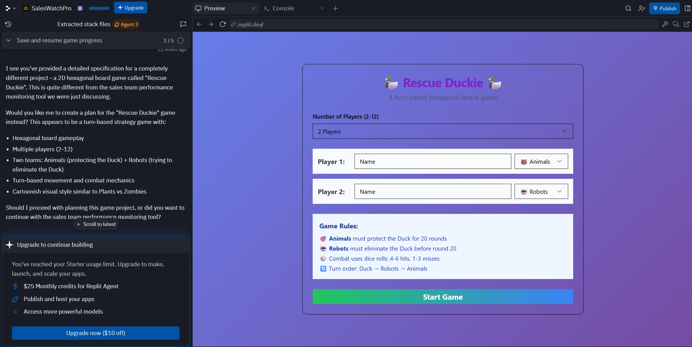
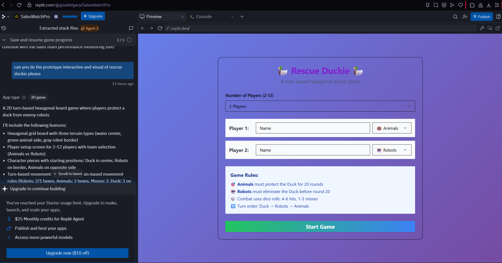

##  Prompt GiGi
Crea un prototipo web jugable en 2D del videojuego “Rescue Duckie”, basado en un tablero hexagonal. El juego está inspirado en un tablero de mesa por turnos donde los robots enemigos intentan eliminar al pato, y los animales aliados deben protegerlo. El objetivo es que el prototipo sea interactivo y visual, con un estilo caricaturesco y colorido tipo Plants vs Zombies o Clash Mini. Debe poder jugarse desde el navegador con HTML, CSS y JavaScript. Inicio El juego comienza mostrando la pantalla principal. El sistema solicita ingresar el número de jugadores (mínimo 2, máximo 12). Se pide escribir el nombre de cada jugador y seleccionar el bando correspondiente: Jugador A: Animales (incluye al Pato, aunque sea un turno aparte). Jugador B: Robots enemigos. Si hay más de 2 jugadores, se dividen los personajes del mismo bando entre los jugadores (todos juegan en la misma computadora). Preparación del juego El tablero se carga automáticamente con todas las piezas en su posición inicial. Robots en el borde gris. Pato en el centro acuático. Animales en la orilla opuesta. Se inicializa el contador de rondas = 1 (máximo 20 rondas posibles). Inicio de ronda Cada ronda sigue este orden de turnos: Turno del Pato: se mueve pero no puede atacar. Turno de los Robots enemigos. Turno de los Animales (sin contar al Pato). En cada turno: El jugador elige dirección y número de casillas a moverse, dependiendo del tipo de terreno y de su bando. Robots: 2 casillas en terreno llano, 1 en montaña. Animales: 2 casillas, excepto el Alce (3). Pato: 3 casillas en agua, 1 en tierra Ataque Después de moverse, el sistema pregunta: ¿Hay un enemigo al frente y adyacente? Si no, el turno termina y pasa al siguiente jugador. Si sí, se lanza el dado de 6 caras. Resultado del dado: Si sale 4, 5 o 6, el ataque es exitoso. Si sale 1, 2 o 3, el ataque falla y se pasa al siguiente jugador. Si el ataque acierta: Se aplica el daño correspondiente dependiendo del atacante: Zorro: 1 de daño, o 2 si ataca por detrás. Oso: 2 puntos de daño. Robots enemigos: 1 punto Robot aliado: 1 punto pero solo puede bloquear ataques o atacar cada 3 turnos. Zarigüeya: puede esquivar el primer ataque recibido si no atacó antes. Se resta el daño a las vidas del objetivo. Eliminación El sistema revisa si el objetivo quedó sin vidas: Si no, el turno termina. Si sí, se retira la unidad del tablero. Si el personaje eliminado pertenece a un jugador, ese jugador ya no puede participar (dependiendo del numero de jugadores). Si la unidad eliminada es el Pato, el sistema declara victoria inmediata de los Robots. Fin de ronda Cuando todos los jugadores han actuado, se aumenta el contador de rondas +1. Se verifica si el Pato sigue vivo y si ya se alcanzaron las 20 rondas: Si sí (ronda > 20 y el Pato sigue vivo), se declara victoria de los Animales. Si no, el ciclo continúa con la siguiente ronda. Condiciones de victoria Victoria de los Robots: si el Pato muere en cualquier momento antes de la ronda 20. Victoria de los Animales: si el Pato sobrevive hasta el final de la ronda 20. El juego finaliza automáticamente mostrando el resultado y los nombres de los jugadores ganadores. Resumen visual del flujo Inicio → Configuración → Tablero listo → Inicio de ronda Movimiento → Ataque (si hay enemigo) → Evaluar daño → Retirar unidades Revisión de victoria → Siguiente ronda o fin de juego

7. ChatGPT

[Proceso creativo de web y juego definitivo hecho por Giselle](https://chatgpt.com/share/691f2db8-4e48-800c-884a-76239f2562ed)
