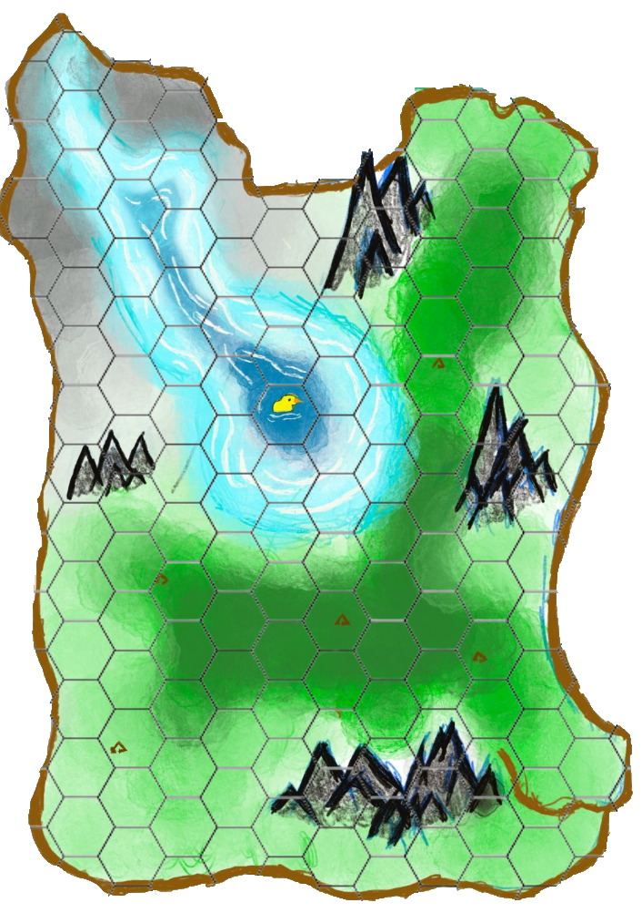
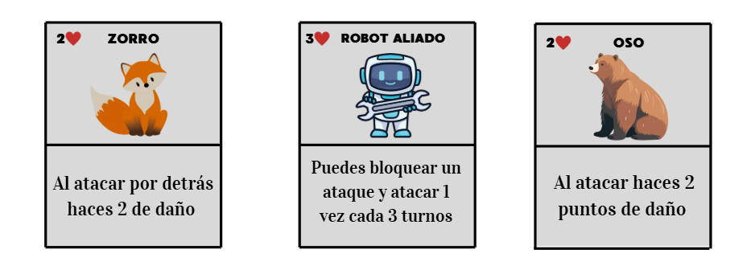
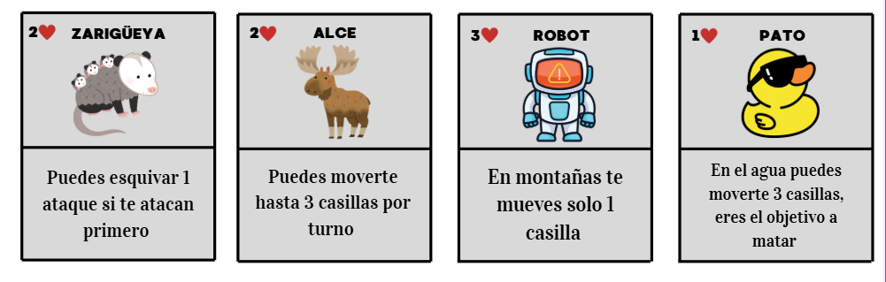

# Robot salvaje
### Giselle Gallegos Ramos
### Felipe Cortes Vazquez Gargallo
### Federico Marquez Martinez
## Protege al pato
El juego se desarrolla en una isla dividida en diferentes terrenos:

- Bosque.

- Montañas, , donde el movimiento es más lento.

- Ríos y zonas de agua, donde el Pato va mas rapido.

- Zonas llanas.

Los robots comienzan en el borde gris, el pato en el centro y el resto de los animales en la otra orilla paralela a los robots.

## Personajes y habilidades
- Zorro: Al atacar por atras haces 2 de daño, tienes 2 vidas
- Robot Aliado: Puedes proteger al Pato o a otro animal bloqueando ataques cada 3 turnos, tienes 3 vidas.
- Oso: Haces 2 puntos de daño al atacar, tienes 2 vidas.
- Zarigüeya: Puedes esquivar un ataque si te atacan primero, tienes 2 vidas.
- Alce: Puedes moverte hasta 3 casillas por turno, tienes 2 vidas
- Robot malo: En montañas solo te puedes mover una casilla, tienes 3 vida
- Pato: En el agua puedes moverte 3 casillas, eres el objetivo a matar solo tienes 1 vida.

## Movimiento
- Robots: pueden moverse hasta 2 espacios en terrenos llanos, pero solo 1 en montañas.
- Animales: pueden moverse hasta 2 espacios, excepto el alce, que se mueve hasta 3. El pato que en agua puede moverse hasta 3 espacios tambien.

## Ataque 
Si un jugador está frente a su contrincante lanza un dado de 6 caras. Un resultado de 4 a 6 indica un ataque exitoso, que reduce 1 punto de vida del oponente. Si el resultado es de 1 a 3 no comete el ataque.

## Objetivo 
- El objetivo de los animales es proteger al pato
- El objetivo del pato es huir de los robots
- El objetivo de los robots es llegar al pato y matarlo

## Condiciones de victoria y puntuacion
- Victoria de los Robots: Matan al Pato antes de 25 turnos ganan.
- Victoria de los Animales: Protegen al Pato hasta el turno 25 ganan.

## Próximos pasos para versión digital

- Digitalizar el tablero y fichas.
- Crear interfaz para movimientos por casillas.
- Implementar sistema de turnos y dado virtual.
- Programar habilidades de cada personaje.
- Añadir condiciones de victoria automáticas.

[Pagina](https://gigifgr.github.io/pato_salvaje_robot/)