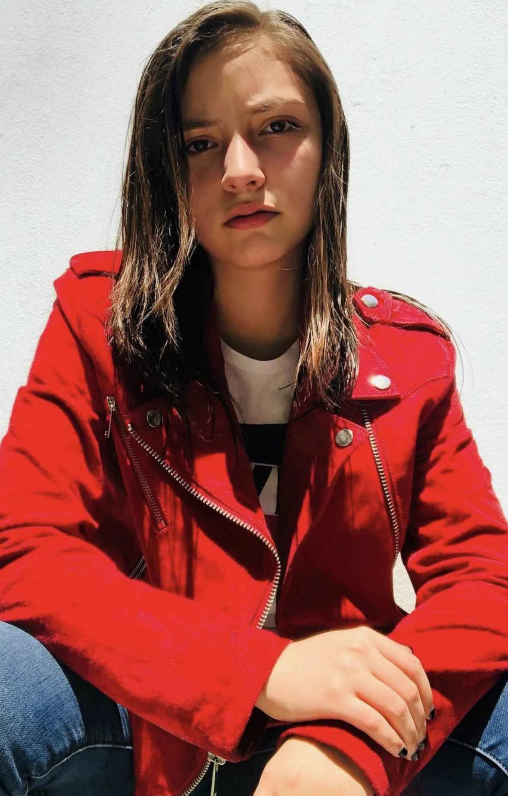
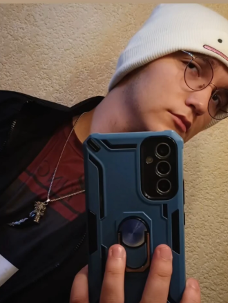
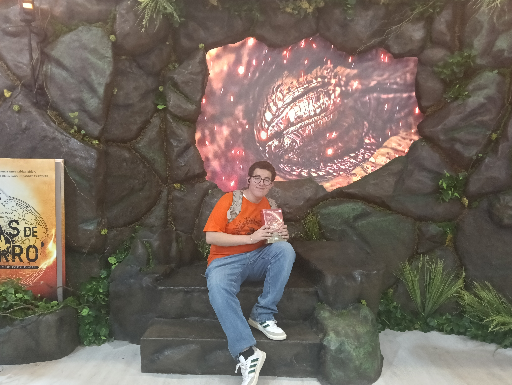

# Giselle Gallegos Ramos

### Rol en el proyecto:
Programadora principal. Responsable del desarrollo completo de la versión digital del juego web. Me encargare de implementar todas las mecánicas, los turnos, la lógica de los personajes, el sistema de dados, detección de colisiones, interfaz de usuario y condiciones de victoria.

#### Inventario de actividades:  
- Implementación del tablero digital interactivo.  
- Programación de los movimientos por casillas.  
- Codificación de habilidades de cada personaje.  
- Sistema de turnos y control de turnos automáticos.  
- Programación del dado virtual.  
- Integración de interfaz gráfica (UI).    
- Técnica del código. 

# Felipe Cortés Vázquez Gargallo

## ROL
Diseñador visual y apoyo en programación. Encargado del diseño gráfico del tablero, fichas y elementos visuales del juego. Apoyo en la integración de los recursos dentro de la web y realizo pruebas de interfaz junto con la programadora principal.

Inventario de actividades:
- Creación final del arte del tablero digital.  
- Diseño final de las tarjetas de personaje.  
- Elaboración de interfaz visual.  
- Colaboración en ajustes de movimiento y animaciones.  
- Revisión visual general del juego.  
- Pruebas de funcionamiento y corrección de errores.
- ⁠Apoyo en programación.

# Federico Marquez Martinez 

Rol en el proyecto:
Asistente de apoyo general. Colabora en tareas básicas dentro de la versión digital. Su participación se enfoca en apoyo a los demás miembros, organización de recursos y documentación básica.

Inventario de actividades:
- Apoyo en la preparación. 
- Colaboración en pruebas de juego y feedback.  
- Búsqueda de referencias visuales.  
- Registro de observaciones en los test de jugabilidad.  
- Apoyo en la documentación y revisión general.
- ⁠Apoyo de ideas al proyecto.
- ⁠Apoyo en lo que se necesite.