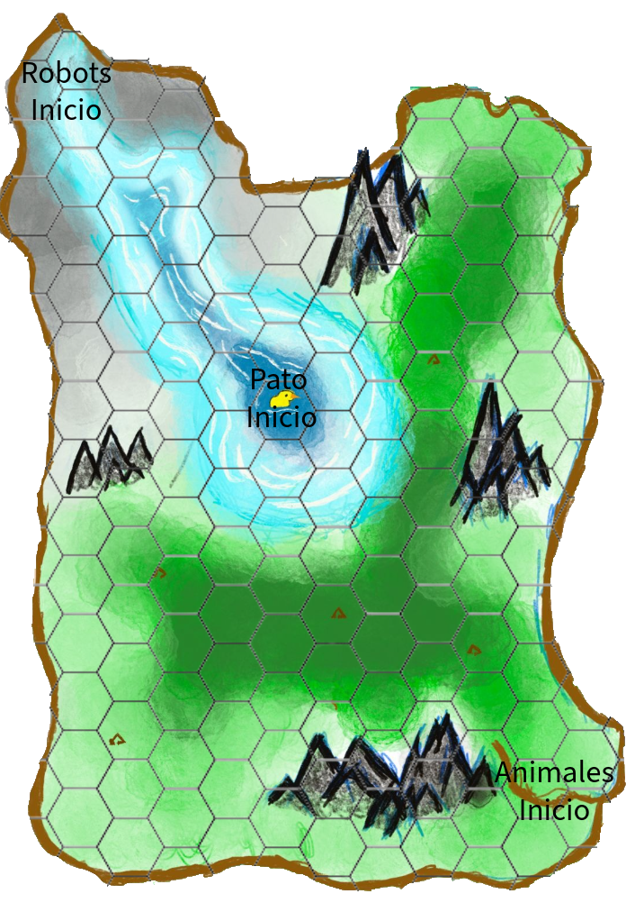

# Lenguaje Natural

##  Inicio
1. El juego comienza mostrando la pantalla principal.
2. El sistema solicita ingresar el **número de jugadores** (mínimo 2, máximo 12).
3. Se pide escribir el **nombre de cada jugador** y seleccionar el **bando** correspondiente:
   - Jugador A: **Animales** (incluye al **Pato**, aunque sea un turno aparte).
   - Jugador B: **Robots enemigos**.
   - Si hay **más de 2 jugadores**, se dividen los personajes del mismo bando entre los jugadores (todos juegan en la misma computadora).

##  Preparación del juego
1. El **tablero se carga automáticamente** con todas las piezas en su posición inicial.
   - Robots en el borde gris.
   - Pato en el centro acuático.
   - Animales en la orilla opuesta.
2. Se inicializa el **contador de rondas = 1** (máximo 20 rondas posibles).
3. (Opcional) Si se activa el modo equilibrado:
   - Cada bando lanza un dado para decidir quién comienza la primera ronda.
   - El orden de los turnos se ajusta según el resultado (por ejemplo: si ganan los Robots, inician ellos, luego los Animales y finalmente el Pato).

## Inicio de ronda
1. Cada ronda sigue este **orden de turnos**:
   1. **Turno del Pato:** se mueve pero **no puede atacar**.
   2. **Turno de los Robots enemigos.**
   3. **Turno de los Animales** (sin contar al Pato).

2. En cada turno:
   - El jugador elige **dirección y número de casillas a moverse**, dependiendo del **tipo de terreno** y de su **bando**.
     - Robots: 2 casillas en terreno llano, 1 en montaña.
     - Animales: 2 casillas, excepto el Alce (3).
     - Pato: 3 casillas en agua.

## Ataque
1. Después de moverse, el sistema pregunta:  
   **¿Hay un enemigo al frente y adyacente?**
   - Si **no**, el turno termina y pasa al siguiente jugador.
   - Si **sí**, se lanza el **dado de 6 caras**.

2. **Resultado del dado:**
   - Si sale **4, 5 o 6**, el ataque **es exitoso**.
   - Si sale **1, 2 o 3**, el ataque **falla** y se pasa al siguiente jugador.

3. Si el ataque acierta:
   - Se aplica el **daño correspondiente** dependiendo del atacante:
     - Zorro: 1 de daño, o 2 si ataca por detrás.
     - Oso: 2 puntos de daño.
     - Robots enemigos: 1 punto (o 2 si se usa la versión balanceada).
     - Robot aliado: 1 punto y puede bloquear ataques cada 3 turnos.
     - Zarigüeya: puede esquivar el primer ataque recibido si no atacó antes.
   - Se resta el daño a las **vidas del objetivo**.

## Eliminación
1. El sistema revisa si el objetivo **quedó sin vidas**:
   - Si no, el turno termina.
   - Si sí, se **retira la unidad del tablero**.
   - Si el personaje eliminado pertenece a un jugador, ese jugador ya **no puede participar** (solo observa el resto del juego).

2. Si la unidad eliminada es el **Pato**, el sistema declara **victoria inmediata de los Robots**.

## Fin de ronda
1. Cuando todos los jugadores han actuado, se **aumenta el contador de rondas +1**.
2. Se verifica si el **Pato sigue vivo** y si **ya se alcanzaron las 20 rondas**:
   - Si **sí** (ronda > 20 y el Pato sigue vivo), se declara **victoria de los Animales**.
   - Si **no**, el ciclo continúa con la siguiente ronda.

## Condiciones de victoria
- **Victoria de los Robots:** si el Pato muere en cualquier momento antes de la ronda 20.
- **Victoria de los Animales:** si el Pato sobrevive hasta el final de la ronda 20.
- El juego finaliza automáticamente mostrando el resultado y los nombres de los jugadores ganadores.

## Resumen visual del flujo
1. Inicio → Configuración → Tablero listo → Inicio de ronda  
2. Movimiento → Ataque (si hay enemigo) → Evaluar daño → Retirar unidades  
3. Revisión de victoria → Siguiente ronda o fin de juego

> **Nota:** El Pato nunca puede atacar, y siempre tiene su propio turno, incluso si los Animales ya actuaron.  
> Esto asegura que el orden de juego se mantenga balanceado y claro.

